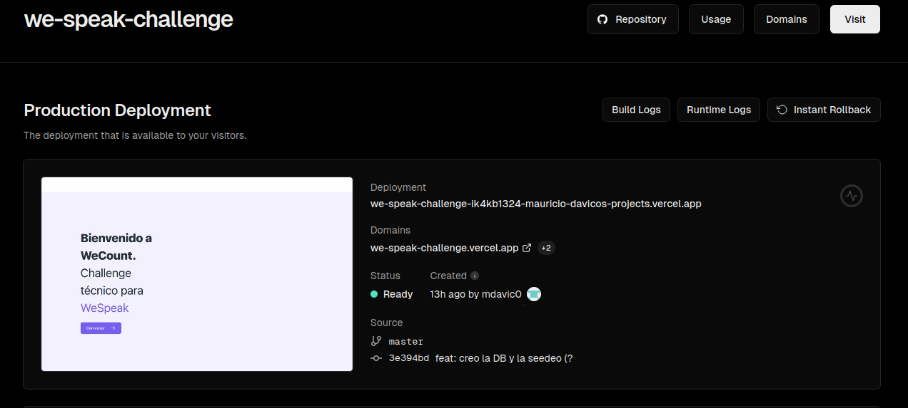
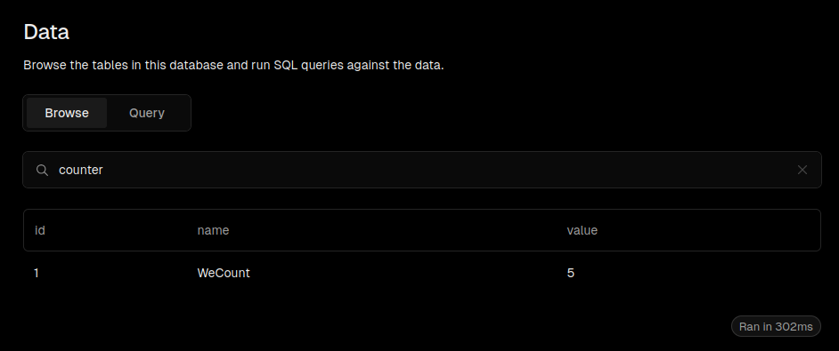

# Creación de un contador con persistencia en base de datos
Aplicación web sencilla utilizando Next.js que implementa un contador cuyos valores se persistan en una base de datos.


- Framework: Next.js.
- Base de Datos: Vercel Postgres
- Lenguaje: JavaScript.
- ORM: Prisma para manejar las consultas con la base de datos.
- Estilos: Tailwind CSS.
- Deploy: Vercel.



## Funcionalidades
- Onboarding: Pantalla de bienvenida, navegacion hacia el contador usando `Link from 'next/link'`.

- Contador Dinámico: El contador muestra un número que se puede incrementar o decrementar con los botones + y -. Cada cambio en el valor se refleja en la base de datos.

- Persistencia en la Base de Datos: Los valores del contador se almacenan en una base de datos PostgreSQL (Vercel Postgres). Cada vez que se recarga la página, el valor del contador se obtiene directamente de la base de datos.




- Carga Optimizada con Skeleton Loader: Cuando se está cargando el valor del contador, se muestra un "skeleton loader" para dar una mejor experiencia visual mientras los datos se obtienen del servidor.

- Actualización Sin useState: El estado del contador se actualiza directamente desde la base de datos usando fetch en lugar de useState para manejar el contador.


# Ejecución

1) Clonar el repositorio
```bash
    git clone git@github.com:mdavic0/we.speak-challenge.git
```

2) Instalar dependencias
En la raiz del proyecto ejecutar
```bash
npm install
```

3) Ejecutar el servidor de desarrollo
```bash
npm run dev
# or
yarn dev
# or
pnpm dev
# or
bun dev
```

4) Luego abrir [http://localhost:3000](http://localhost:3000).
